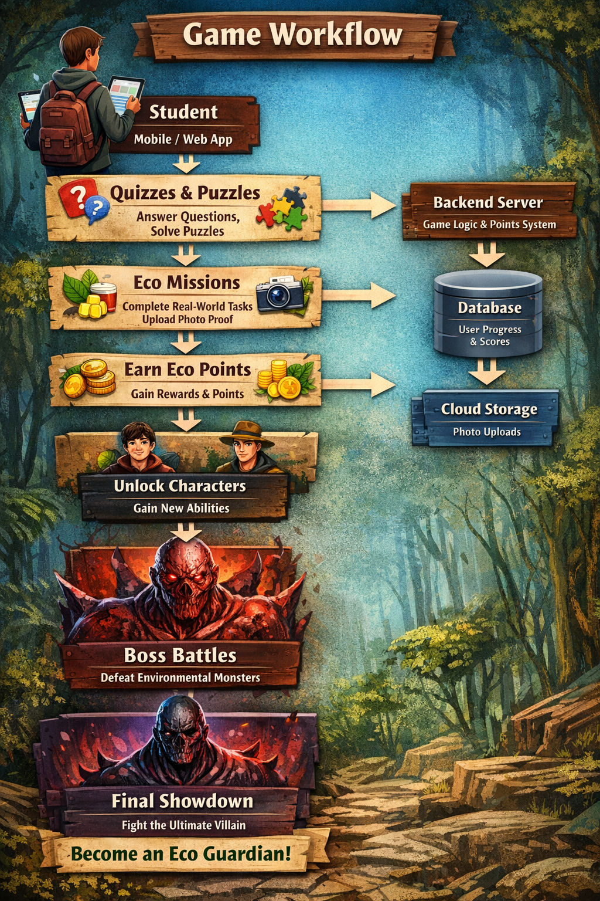

# Smart India Hackathon Workshop
# Date:13/03/2026
## Reference Number:25009408/212225040033
## Name:Ashwin Kumar .M

## Problem Title
SIH 25009: Gamified Environmental Education Platform for Schools and Colleges

## Problem Creater's Organization
Department of Higher Education, Government of Punjab

## Theme
Smart Education

## Problem Description
### Problem Statement
<ul>
  <li>Despite the rising urgency of climate change and environmental degradation, environmental education remains largely theoretical in many Indian schools and colleges. Students are often taught textbook-based content with little emphasis on real-world application, local ecological issues, or personal responsibility.</li>
  <li>There is a lack of engaging tools that motivate students to adopt eco-friendly practices or understand the direct consequences of their lifestyle choices. Traditional methods fail to instill sustainable habits or inspire youth participation in local environmental efforts.</li>
</ul>

### Impact
<ul>
  <li>As future decision-makers, students must be environmentally literate and empowered to take meaningful actions. Without innovative education methods, we risk raising a generation unaware of sustainability challenges.</li>
  <li>An interactive, practical approach to environmental learning will foster long-term behavioral change, local involvement, and a ripple effect across families and communities. This aligns with India's SDG goals and NEP 2020's emphasis on experiential learning.</li>
</ul>

### Expected Outcomes
<ul>
  <li>A gamified mobile/web platform or app that teaches students about environmental issues through interactive lessons, challenges, quizzes, and real-world tasks (e.g., tree-planting, waste segregation).</li>
  <li>Tracking of eco-points, enabling school-level competitions.</li>
  <li>Rewards for sustainable practices through digital badges and recognition.</li>
</ul>

## Proposed Solution
```
We propose a gamified environmental learning platform that transforms environmental education into an interactive adventure game. Instead of traditional textbook learning, students progress through levels by completing quizzes, solving puzzles, and performing real-world environmental tasks.

In the platform, students start as a basic player who must protect the environment from dangerous forces that represent pollution, climate change, and ecological damage.

Students earn Eco Points by completing the following activities:

Answering environmental quiz questions

Solving environmental puzzles

Completing real-world eco missions

Uploading photo proof of activities such as planting trees, waste segregation, or saving energy

As students accumulate eco points, they unlock new characters with special abilities that help them progress faster and solve complex challenges.

The game is structured into levels. After every 7 levels, the student encounters a monster representing a major environmental problem such as plastic pollution, deforestation, or air pollution. To defeat the monster, the student must successfully complete a set of quizzes and environmental challenges.

Once the monster is defeated, the player receives bonus eco points and unlocks new abilities or characters.

At the final stage of the game, students face a powerful final monster that represents global environmental destruction. To defeat this final boss, students must apply all the environmental knowledge and skills they have learned throughout the game.

Through this engaging storyline and mission-based learning approach, students become Environmental Guardians, encouraging them to adopt sustainable habits in their daily lives.

This Idea is created using the context of Stranger Things web series

```
## Technical Approach

```
The platform will be developed as a mobile and web-based application so that students can easily access it through smartphones, tablets, or computers.

Technologies Used

Frontend: HTML, CSS, JavaScript or Flutter for mobile development

Backend: Node.js / Python for handling game logic and user data

Database: Firebase or MySQL for storing user progress, eco points, and uploaded images

Cloud Storage: To store images uploaded as proof for eco missions

System Workflow
```
```
Neccessary things need to be followed :

Students register and create their player profile.

The platform provides quizzes, puzzles, and environmental learning modules.

Students complete activities and upload images for real-world eco missions.

Eco points are awarded based on task completion.

Players unlock characters with special abilities as they progress.

If a daily task is missed, the player must defeat additional monsters before progressing,they may be very tough to handle carefull!!!

After every 7 levels, players fight a major environmental monster and earn bonus rewards.

The final stage includes defeating the main environmental villain to complete the game.
```

## Feasibility and Viability
```
Most schools and students already have access to smartphones or computers, making the platform easy to implement.

Potential Challenges 

Students may upload incorrect images for eco missions

Internet access may be limited in some areas

Maintaining long-term engagement

Strategies to Overcome Challenges

Teacher verification or automated review for uploaded photos

Offline quiz modules for limited internet connectivity

Leaderboards and rewards to maintain student motivation
```

## Impact and Benefits
```
The proposed platform has strong educational, social, and environmental benefits.

Educational Impact

Students learn environmental concepts through interactive quizzes, puzzles, and practical activities, making learning more engaging than traditional methods.

Behavioral Impact

By completing real-world eco missions such as tree planting and waste segregation, students develop sustainable habits that continue beyond the game.

Social Impact

Students can compete with classmates and schools through eco-point leaderboards, encouraging collective participation in environmental protection.

Environmental Impact

The platform promotes real environmental actions such as reducing waste, conserving water, and planting trees, which contribute to environmental sustainability.

Overall, the platform helps develop environmentally responsible students who actively contribute to protecting the planet.
```

## Research and References
https://www.education.gov.in/en/nep-new https://sdgs.un.org/goals https://www.unesco.org/en/sustainable-development/education
